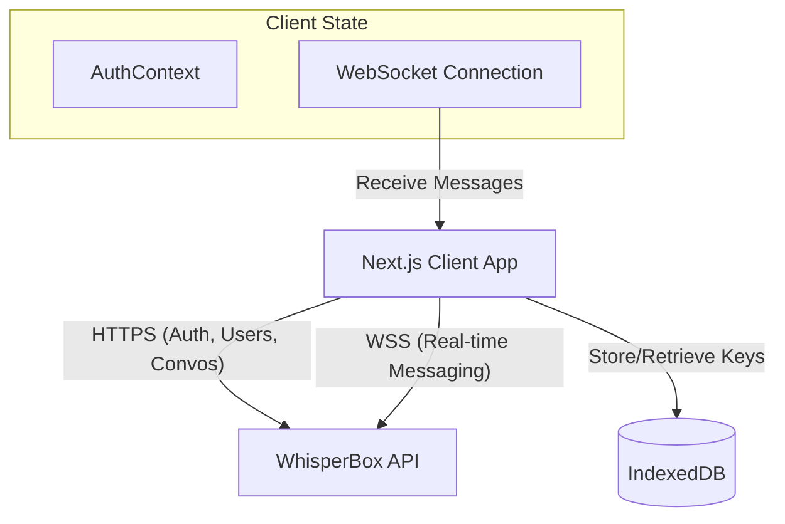

# Hush — Keep it between you two

Hush is an end-to-end encrypted web messaging app built as part of the HNG Internship.
It leverages modern web technologies to provide secure, real-time communication.

## Architecture

- **Frontend:** Next.js 16 (App Router), React, TypeScript, Tailwind CSS, shadcn/ui.
- **Backend:** WhisperBox API (`https://whisperbox.koyeb.app`).
- **State Management:** React Context (Auth), Custom Hooks (`useConversations`, `useMessages`, `useWebSocket`).
- **Real-time:** Native WebSockets.

## Encryption Flow

Hush uses the Web Crypto API to ensure end-to-end encryption (E2EE) for all messages.

1. **Registration:**
   - Client generates an RSA-OAEP key pair.
   - The Public Key is sent to the server.
   - The Private Key is wrapped using AES-GCM and stored securely (with the local copy in IndexedDB).

2. **Sending a Message:**
   - The sender fetches the recipient's public key from the server.
   - The sender generates a random AES-GCM symmetric key (session key) for the message.
   - The message is encrypted with this session key.
   - The session key is then encrypted with the recipient's public key.
   - The encrypted message and encrypted session key are sent to the server.

3. **Receiving a Message:**
   - The recipient receives the encrypted payload (encrypted message + encrypted session key) via WebSocket or REST.
   - The recipient uses their private key (unwrapped locally) to decrypt the session key.
   - The session key is used to decrypt the actual message.

## Key Management

- **Public Keys:** Stored on the WhisperBox server and distributed to other users to facilitate encrypted communication.
- **Private Keys:** Never leave the client in plaintext. They are securely wrapped (encrypted) and the local copy is kept in IndexedDB using the `idb` library for fast retrieval during the active session.
- **Session Keys:** Generated on the fly for each message and discarded after encryption/decryption.

## Security Trade-offs

- **Browser Environment:** Running cryptographic operations in a web browser means the app is susceptible to XSS (Cross-Site Scripting). If an attacker injects a malicious script, they could potentially access the unwrapped private key or read messages before they are encrypted. This is mitigated through React's built-in XSS protection and careful state management.
- **Account Recovery vs. Security:** Because private keys are wrapped and stored client-side/securely, account recovery without the necessary decryption material (like a password or recovery phrase) is impossible. This prioritizes absolute data security over user convenience.
- **Metadata Leakage:** While message contents are strictly end-to-end encrypted, metadata (who is communicating with whom, timestamps, and payload sizes) is still visible to the central server.

## Known Limitations

- **Multi-device Synchronization:** Synchronizing E2EE keys and message history across multiple devices for a single user is complex and currently not fully supported. The app is optimized for a primary active session.
- **Perfect Forward Secrecy (PFS):** The current RSA-based session key exchange does not provide the same level of Perfect Forward Secrecy as advanced protocols like the Double Ratchet algorithm (used by Signal).
- **Browser Compatibility:** Reliance on the native Web Crypto API means that older or non-standard browsers lacking support for specific algorithms (e.g., RSA-OAEP, AES-GCM) will not be able to run the application.
